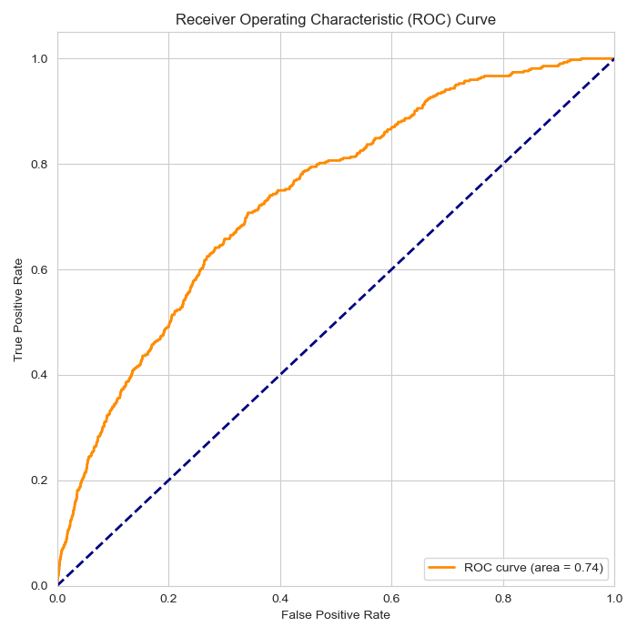
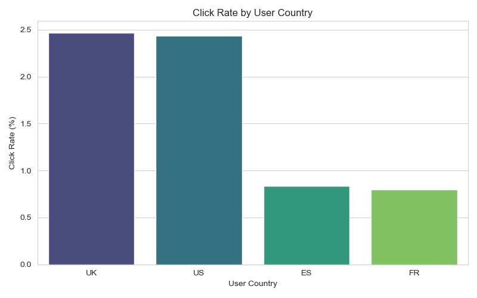
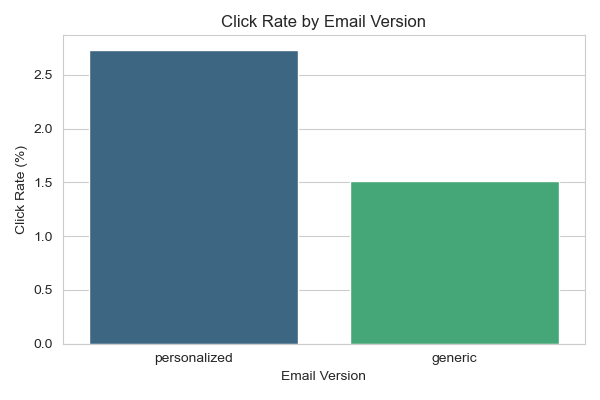
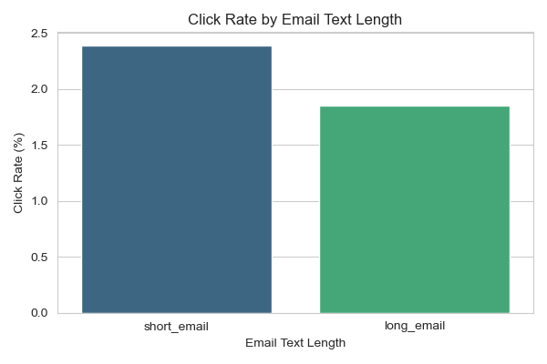
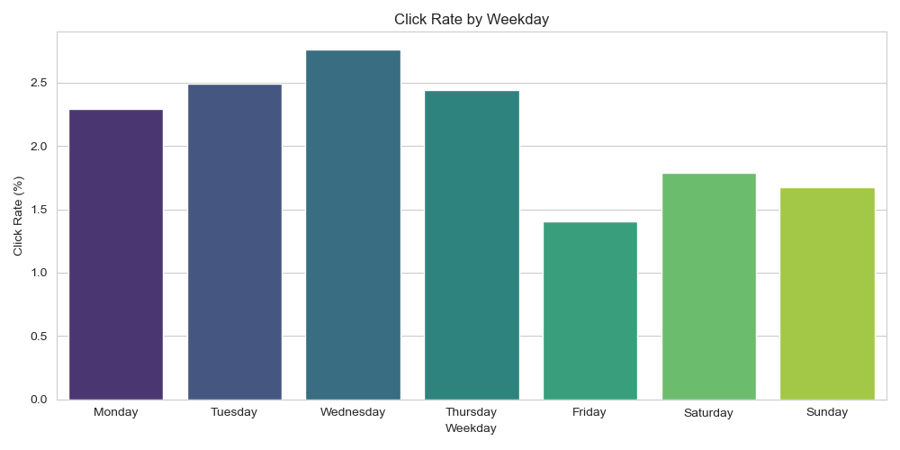
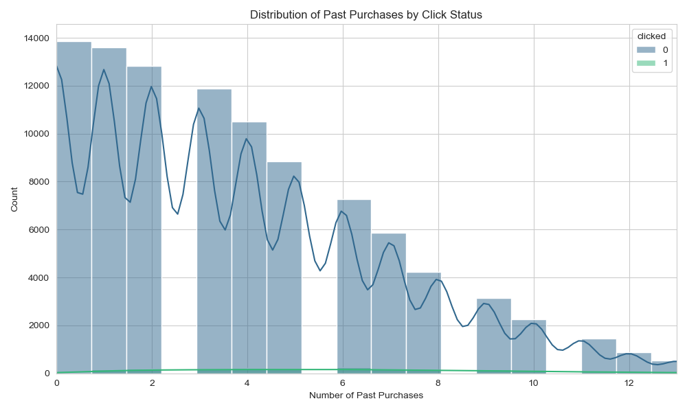

# Email Marketing Campaign Optimization Analysis

## Direct colab link:
https://colab.research.google.com/drive/1PQqrXMz44VnauMQduZXn3DzXu_QSFw-7?usp=sharing

## Introduction

This project analyzes the performance of an email marketing campaign for an e-commerce site. The goal was to understand user engagement (opens and clicks) and build a predictive model to optimize future campaigns by maximizing the probability of users clicking the link within the email.

The analysis is based on three data files:
*   `email_table.csv`: Information about each email sent (text, version, timing, user details).
*   `email_opened_table.csv`: IDs of emails that were opened.
*   `link_clicked_table.csv`: IDs of emails where the link was clicked.

## Setup & Usage

### Requirements

The analysis script requires the following Python libraries:
*   pandas
*   scikit-learn
*   matplotlib
*   seaborn

You can typically install these using pip:
```bash
pip install pandas scikit-learn matplotlib seaborn
```

### Running the Analysis

To run the full analysis, execute the Python script from your terminal in the project directory:

```bash
python analyze_campaign.py
```

This script will:
1.  Load and preprocess the data from the CSV files.
2.  Calculate overall open and click rates.
3.  Train a Logistic Regression model to predict link clicks.
4.  Evaluate the model's performance.
5.  Perform segment analysis based on various features.
6.  Generate and save visualizations to the `plots/` directory.

## Analysis and Findings

The analysis addresses the key questions posed in the case study:

### Q1: Campaign Performance Metrics

*   **Overall Open Rate:** 10.35% of the emails sent were opened.
*   **Overall Click Rate (based on total sent):** 2.12% of the emails sent resulted in a link click.
*   **Click-Through Rate (based on opens):** 20.48% of the emails that were opened resulted in a link click.

### Q2: Click Prediction Model

A model was built to predict the probability of a user clicking the link inside the email based on available features.

**Model Choice: Logistic Regression**

*   **Why Logistic Regression?**
    *   **Binary Classification:** This is a classic binary classification problem (click vs. no-click), which Logistic Regression is specifically designed for.
    *   **Efficiency & Baseline:** It's computationally efficient to train and serves as a strong baseline model.
    *   **Interpretability:** The model's coefficients provide insights into how each feature influences the probability of a click, making the results understandable.
*   **Intuitive Explanation:** Think of Logistic Regression as a smart system that learns patterns from past data. It looks at characteristics of the email (like whether it was personalized) and the user (like their country or purchase history) to estimate the chance (a probability score between 0 and 1) that sending a *specific* email to a *specific* user will result in a click.

**Features Used:**
The model used the following features to make predictions:
`email_text`, `email_version`, `hour`, `weekday`, `user_country`, `user_past_purchases`.

**Model Performance:**
The model's ability to distinguish between users who click and those who don't is reasonably good, indicated by an **AUC (Area Under the Curve) score of 0.74**. An AUC score greater than 0.5 means the model performs better than random guessing.

The ROC (Receiver Operating Characteristic) curve visually represents this performance:



### Q3: Potential Improvement & Testing Strategy

The predictive model allows for optimizing future campaigns. Instead of sending emails randomly (achieving a 2.12% click rate), the marketing team can use the model to score users based on their predicted probability of clicking. By targeting only those users with a probability above a certain threshold (e.g., the top 20% most likely to click), the overall click rate of the campaign can be significantly improved.

**Testing Recommendation:**
The most reliable way to quantify this improvement and validate the model is through an **A/B test**:
*   **Group A (Control):** Send emails randomly to a sample of users (current strategy).
*   **Group B (Treatment):** Use the model to predict click probabilities for another sample. Send emails *only* to users in this group whose predicted probability exceeds a chosen threshold.
*   Compare the click-through rates (clicks / emails sent) between Group A and Group B. A statistically significant higher rate in Group B confirms the model's value.

### Q4: Interesting Patterns in User Segments

Several interesting patterns emerged regarding how different user segments responded to the campaign:

*   **User Country:** Users in the UK and US showed significantly higher click rates compared to users in Spain (ES) and France (FR).
    

*   **Email Personalization:** Personalized emails (containing the user's name) had a substantially higher click rate (2.73%) than generic emails (1.51%).
    

*   **Email Length:** Short emails performed slightly better than long emails in terms of click rate.
    

*   **Send Day:** Emails sent mid-week (Wednesday, Tuesday, Thursday) tended to have higher click rates compared to emails sent on weekends or Friday.
    

*   **Past Purchases:** Users with a history of more past purchases showed a slightly higher tendency to click the link.
    

## Conclusion

The analysis revealed key performance metrics and actionable insights for optimizing future email campaigns. The developed Logistic Regression model provides a tool to target users more effectively, potentially increasing the click-through rate significantly compared to random sending. Segment analysis highlights the importance of personalization and suggests potential adjustments to targeting based on geography and send timing. A/B testing is recommended to validate the model's impact in a live environment.

## Project Structure

```
.
├── ML intern - Case Study Task.pdf  # Original task description
├── README.md                      # This file
├── analyze_campaign.py            # Main Python script for analysis and modeling
├── email_opened_table.csv         # Data: Opened email IDs
├── email_table.csv                # Data: Email details
├── link_clicked_table.csv         # Data: Clicked link email IDs
└── plots/                         # Directory containing generated plots
    ├── click_rate_by_country.png
    ├── click_rate_by_text.png
    ├── click_rate_by_version.png
    ├── click_rate_by_weekday.png
    ├── past_purchases_distribution.png
    └── roc_curve.png
