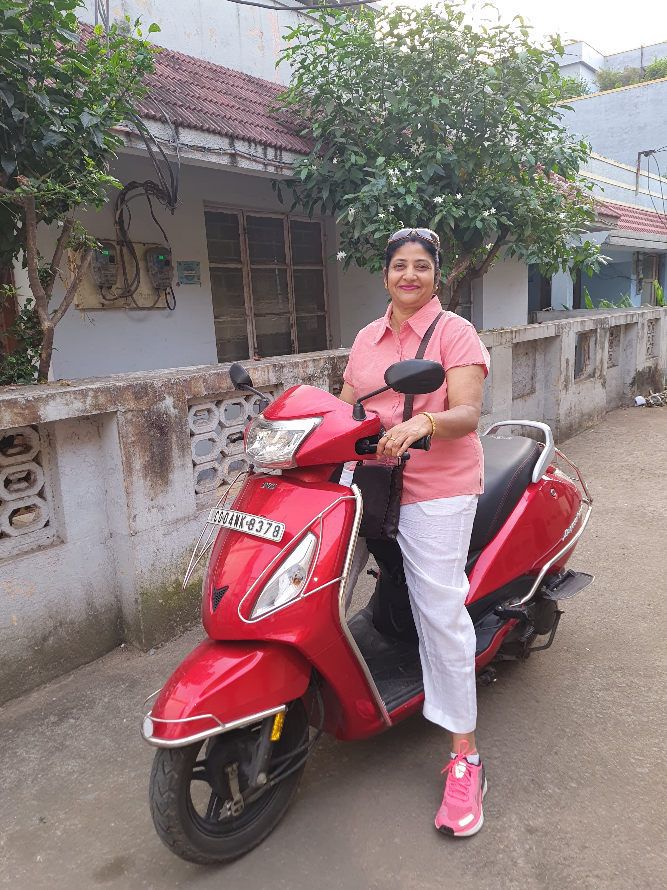

# Helmet Detection using YOLOv5

This project uses YOLOv5 to detect whether people in images or videos are wearing helmets. It includes scripts for data preparation, training (using the standard YOLOv5 workflow), and a Streamlit application for interactive detection.

## Features

*   Detects 'helmet' and 'no_helmet' classes.
*   Supports detection in both images and videos.
*   Provides scripts for converting Pascal VOC annotations to YOLO format.
*   Includes a script to split the dataset into training and validation sets.
*   Offers a Streamlit web interface for easy detection.

## Example Detection

Here's an example of the model detecting helmets on a test image:

**Original Image (`test_image.jpeg`)**



**Detected Image (`detected.jpeg`)**


*(Note: Ensure `detected.jpeg` is present in the `Helmet detection` directory to see the result here.)*

## Project Structure

```
Helmet detection/
├── dataset/
│   ├── images/         # Raw images go here
│   │   ├── train/      # Populated by split_train_val.py
│   │   └── val/        # Populated by split_train_val.py
│   ├── annotations/    # Raw XML annotations go here
│   └── labels/         # YOLO format labels (generated by convert_annotations.py)
│       ├── train/      # Populated by split_train_val.py
│       └── val/        # Populated by split_train_val.py
├── yolov5/             # YOLOv5 submodule/directory
│   ├── runs/
│   │   ├── train/
│   │   │   └── exp*/   # Training results (including weights/best.pt)
│   │   └── detect/     # Detection results
│   ├── ... (other YOLOv5 files)
├── convert_annotations.py # Converts VOC XML to YOLO TXT
├── creating_yaml.py       # Creates data.yaml for YOLOv5
├── data.yaml              # Dataset configuration (generated)
├── split_train_val.py     # Splits data into train/val sets
├── streamlit_detector.py  # Streamlit web application
└── README.md              # This file
```

## Setup

1.  **Clone the repository:**
    ```bash
    git clone <repository_url>
    cd "Helmet detection"
    ```
    *(Note: If you've already cloned, navigate to the `Helmet detection` directory)*
2.  **Install dependencies:** Ensure you have Python 3.8+ installed. It's recommended to use a virtual environment.
    ```bash
    # Navigate to the main project directory if you aren't already there
    # cd /path/to/your/project/Helmet detection

    python -m venv venv
    source venv/bin/activate # On Windows use `venv\Scripts\activate`

    # Install YOLOv5 requirements (from within the 'Helmet detection' directory)
    pip install -r yolov5/requirements.txt

    # Install additional dependencies for helper scripts and Streamlit
    pip install streamlit scikit-learn opencv-python Pillow PyYAML
    ```
3.  **(Optional) Install FFmpeg:** Required for video processing in the Streamlit app. Follow instructions for your OS: [https://ffmpeg.org/download.html](https://ffmpeg.org/download.html)

## Data Preparation

1.  Place your raw images in `Helmet detection/dataset/images/`.
2.  Place the corresponding Pascal VOC XML annotations in `Helmet detection/dataset/annotations/`. Ensure filenames match the images (e.g., `image1.jpg` and `image1.xml`).
3.  **Convert annotations:** Run this script from the main `Helmet detection` directory.
    ```bash
    python "Helmet detection/convert_annotations.py"
    ```
    This will create YOLO format `.txt` files in `Helmet detection/dataset/labels/`.
4.  **Split dataset:** Run this script from the main `Helmet detection` directory.
    ```bash
    python "Helmet detection/split_train_val.py"
    ```
    This will create `train` and `val` subdirectories in `dataset/images/` and `dataset/labels/` and copy the files accordingly.
5.  **Create `data.yaml`:** Run this script from the main `Helmet detection` directory.
    ```bash
    python "Helmet detection/creating_yaml.py"
    ```
    This generates `Helmet detection/data.yaml` pointing to the train/val sets using absolute paths.

## Training

Use the standard YOLOv5 training procedure. Run the command from the main `Helmet detection` directory. Adjust parameters like `--img`, `--batch`, `--epochs`, `--weights` as needed.

```bash
# Example training command
python yolov5/train.py --img 640 --batch 16 --epochs 50 --data "Helmet detection/data.yaml" --weights yolov5s.pt --project yolov5/runs/train --name helmet_detection_exp
```
*   Make sure the `--data` argument points to the `Helmet detection/data.yaml` file created earlier.
*   The best model weights will be saved in `yolov5/runs/train/helmet_detection_exp*/weights/best.pt`.

## Detection

### Using Command Line

Use the standard `yolov5/detect.py` script. Run the command from the main `Helmet detection` directory. Point the `--weights` argument to your trained model.

```bash
# Example detection command
python yolov5/detect.py --weights yolov5/runs/train/helmet_detection_exp<X>/weights/best.pt --source <path_to_image_or_video> --project yolov5/runs/detect --name helmet_results
```
*   Replace `<X>` with the actual experiment number from your training run.
*   Replace `<path_to_image_or_video>` with the file you want to test (e.g., `Helmet detection/test_image.jpeg` or `Helmet detection/20sec.mp4`).

### Using Streamlit Web App

1.  **Update Model Path:** Open `Helmet detection/streamlit_detector.py` and ensure the `MODEL_PATH` variable points to your specific `best.pt` file (e.g., `MODEL_PATH = Path("yolov5/runs/train/helmet_detection_exp<X>/weights/best.pt").resolve()`). Replace `<X>` with your experiment number.
2.  **Run the app:** Run this command from the main `Helmet detection` directory.
    ```bash
    streamlit run "Helmet detection/streamlit_detector.py"
    ```
3.  Open the provided URL in your web browser and upload an image or video.
